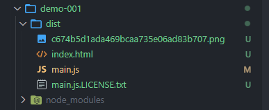

## webpack 基础

`webpack`是前端项目工程化的具体解决方案：提供前端模块化开发支持、代码压缩混淆、处理浏览器端`JavaScript`的兼容性、性能优化等等。

---

### 基本用法体验

1. 新建项目空目录，在终端运行`npm init -y`命令，初始化包管理配置文件`package.json`

2. 运行`cnpm install jquery -S`命令，安装 `jQuery`

    - **_注意：_** `-S`即`--save`，注册到`dependencies`里，生产环境

        &emsp;&emsp;&emsp; `-D`即`--save-dev`，注册到`devDependencies`里，仅在开发环境

3. 此时运行页面，`ES6`语法报错`Uncaught SyntaxError:`，轮到`webpack`登场了(`https://www.npmjs.com/package/webpack`)。

**在项目中配置`webpack`**

1. 安装`webpack`，执行：`cnpm install webpack@5.42.1 webpack-cli@4.7.2 -D`

2. 在项目根目录中，创建`webpack.config.js`，并初始化如下基本配置：

```javascript
module.exports = {
    mode: 'development', // mode 用来指定构建模式，可选 development 和 production
};
```

3. 在`package.json`的`script`节点下，新增`dev`脚本如下：

```json
"scripts": {
    "dev": "webpack"  // script 节点下的脚本，可以通过 npm run 执行，例如：npm run dev ，这里的 dev 指代 webpack
}
```

4. `npm run dev123` _**这条命令先读取`webpack.config.js`，根据里面的配置项，运行`webpack`进行打包**_ ，脚本执行完毕后，`webpack`为你生成了一个`dist`目录。

_**到此，`webpack`工程化基本构建完成。但是，由于还没有配置热更新服务，每次修改业务代码，直接刷新并没有用。必须再次`npm run dev`，刷新生效。**_

---

**`webpack.config.js`脚本配置示例 _(修改了配置文件都要重跑一下)_**

1. `mode`改成`production`

```javascript
module.exports = {
    mode: 'production',
};
```

执行脚本`npm run dev123`，因为这回选择的是生产模式，`main.js`被压缩混淆，具备上线资格了。

2. 自定义打包的入口与出口

    `entry`：指定打包入口，默认：`src`>`index.js`

    `output`：指定打包出口，默认：`dist`>`main.js`

```javascript
const path = require('path');
module.exports = {
    entry: path.join(__dirname, './src/index.js'), // 入口文件路径，指定要处理哪个文件
    output: {
        path: path.join(__dirname, './dist'), // 输出文件的存放路径
        filename: 'bundle.js', // 输出文件的名称
    },
};
```

### webpack 中的插件应用

1.  `webpack-dev-server`

    -   每当修改了源代码，webpack 会自动进行项目的打包和构建
    -   `｢wds｣: webpack output is served from /`输出的资源`main.js`被放到了内存中

2.  `html-webpack-plugin`

    -   配置`src`目录中的`index.html`到服务根目录中

**安装`webpack-dev-server`**

```
cnpm install webpack-dev-server@3.11.2 -D
```

1.  `package.json`中配置`script`

    ```javascript
    "scripts": {
        "dev123": "webpack serve",
    }
    ```

2.  再次运行`npm run dev123`，`webpack-dev-server`会启动一个实时打包的 http 服务

    -   **_注意：_** 报错的话，重新安装相关依赖，到最新版，_例如：本次遇到`webpack-cli`报错，重新安装它到最新版`"webpack-cli": "^4.10.0"`，报错解决_
    -   **_注意：_** `ctrl + c`可以停掉服务

3.  浏览器中`http://localhost:8080`查看打包效果

    -   **_注意：_** 再用`file:///`协议打开页面无效

4.  资源引用路径修改为：`<script src="/main.js"></script>`

    -   **_注意：_** 启动`webpack-dev-server`服务后，就要引用内存中的`main.js`才对，引用物理磁盘中的`../dist/main.js`将无效。

**安装`html-webpack-plugin`**

```
cnpm install html-webpack-plugin@5.3.2 -D
```

配置`webpack.config.js`

```javascript
// 1. 导入 html-webpack-plugin 这个插件，得到插件【构造函数】
const HtmlPlugin = require('html-webpack-plugin');
// 2. new 构造函数，创建插件的实例对象
const htmlPlugin = new HtmlPlugin({
    // 指定要复制哪个页面
    template: './src/index.html',
    // 指定复制出来的文件名和存放路径
    filename: './index.html',
});
module.exports = {
    // 3. 插件的集合，将来 webpack 在运行时，会加载并调用这些插件
    plugins: [htmlPlugin],
};
```

_**到此，`index.html`和`main.js`都被复制出一个副本，写入到内存中去了，并且在服务根目录下同级。**_

配完后`npm run dev123`即可在`http://localhost:8080/`直接访问到`index.html`的内容。

-   拓展配置`webpack.config.js`

```javascript
module.exports = {
    devServer: {
        open: true, // 初次打包完成，自动打开浏览器
        host: '127.0.0.1', // 主机地址设置
        port: 80, // 端口设置
    },
};
```

-   _**常识：`http`协议中，端口号`80`可以被省略**_

### webpack 中的 loader (加载器)

-   **_注意：_**
    1.  `webpack`默认只能打包处理`.js`文件，处理不了其他后缀的文件。
    2.  当前我们的代码中包含了`./css/index.css`这个文件，`webpack`处理不来。
    3.  `webpack`开始查找`webpack.config.js`内的配置项，看`module.rulers`
        中，是否配置了对应的`loader`。
    4.  `webpack`把`index.css`**从后往前**，交给`loader`处理。_**（多个`loader`的调用顺序是：从后往前）**_
    5.  所有加载器处理完毕后，最终的结果合并到`./dist/main.js`中。

**安装`style-loader`和`css-loader`，打包处理`css`文件**

```
cnpm install style-loader@3.0.0 css-loader@5.2.6 -D
```

配置`webpack.config.js`

```javascript
module.exports = {
    // 所有第三方文件模块的匹配规则
    module: {
        rules: [
            // 文件后缀名的匹配规则
            { test: /\.css$/, use: ['style-loader', 'css-loader'] },
        ],
    },
};
```

**安装`less-loader`，处理`less`文件**

```
cnpm install less-loader@10.0.1 less@4.1.1 -D
```

配置`webpack.config.js`

```javascript
module.exports = {
    module: {
        rules: [
            {
                test: /\.less$/,
                use: ['style-loader', 'css-loader', 'less-loader'],
            },
        ],
    },
};
```

**安装`url-loader`，处理样式中相关引用资源路径**

```
cnpm install url-loader@4.1.1 file-loader@6.2.0 -D
```

配置`webpack.config.js`

```javascript
module.exports = {
    module: {
        rules: [
            {
                test: /\.jpg|png|gif$/,
                // 只处理 <= 200B 的图片文件，转换为 base64 格式
                use: 'url-loader?limit=200',
            },
        ],
    },
};
```

**安装`babel-loader`，处理`js`中的高级语法**

```
cnpm install babel-loader@8.2.2 @babel/core@7.14.6 @babel/plugin-proposal-decorators@7.14.5 -D
```

```javascript
{ test: /\.js$/, use: 'babel-loader', exclude: /node_modules/ }
```

配置`babel.config.js`

```javascript
module.exports = {
    // 声明 babel 可用插件
    plugins: [['@babel/plugin-proposal-decorators', { legacy: true }]],
};
```

### webpack 的发布

-   **_注意：_**
    1.  开发模式下，`index.html`和`main.js`被放到了内存中。  
        等到要发布上线时，需要生成到物理磁盘上，才能发给后端部署上线。

配置`package.json`

```json
"scripts": {
    "dev": "webpack serve",
    "build": "webpack --mode production"  // 项目发布时，运行 build 命令
}
```

`--mode`参数项用来指定`webpack`的 **_运行模式_**，`production`模式会进行**代码压缩**和**性能优化**。  
`--mode`参数项，会 **_覆盖_**`webpack.config.js`中的`mode`项。

**运行**`npm run build`，输出`dist`目录如下：



-   **_注意：_** 此时,所有类型文件全部混在一起，需要配置下`webpack.config.js`里的`output`项，添加目录，分门别类。

**安装`clean-webpack-plugin`，每次`build`自动删除`dist`目录**

```
cnpm install --save-dev clean-webpack-plugin
```

-   https://www.npmjs.com/package/clean-webpack-plugin

### Source Map

解决报错行号与源代码 **[行号不一致]** 的问题，方便定位代码。

```javascript
module.exports = {
    // 建议仅在开发模式使用
    mode: 'development',
    devtool: 'eval-source-map',
};
```

-   **_注意：_** **生产环境**，要求只定位行号，不暴露源码。

```
devtool: 'nosource-source-map',
```

### 一些杂项配置

1.  配置别名`@`，指代`src`目录

    -   示例：`import '@/js/test/info.js';`

    ```javascript
    resolve: {
        alias: {
            // 配置别名，用 @ 指代 src 目录
            '@': path.join(__dirname, './src/'),
        },
    },
    ```
