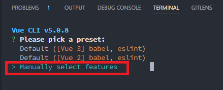
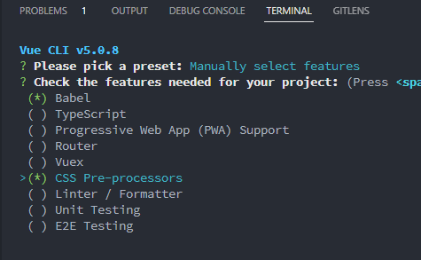
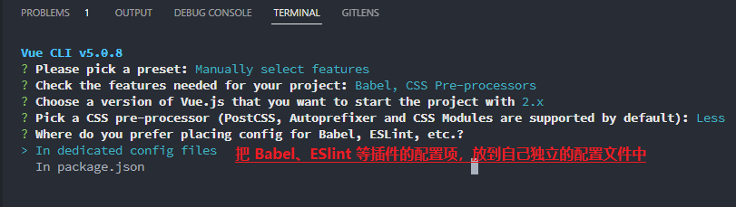

# 使用 vue-cli 构建第一个 vue 项目

**1.全局安装`vue-cli`**

```
cnpm install -g @vue/cli
```

**2.查看版本号**

```
vue -V
```

**3.创建项目**

```
vue create demo-003
```

**4.手动选择预设项**  





**5.启动项目**

```
cd demo-003
npm run serve
```

---

## Project setup

```
npm install
```

### Compiles and hot-reloads for development

```
npm run serve
```

### Compiles and minifies for production

```
npm run build
```

### Customize configuration

See [Configuration Reference](https://cli.vuejs.org/config/).
